# MIND-MCP COGNITIVE ARCHITECTURE
## Architecture Logique Complète

**Version:** 0.1.0  
**Date:** 2025-01-25  
**Status:** Draft — Modélisation

---

## Table des Matières

1. [Vue d'ensemble](#1-vue-densemble)
2. [Layers d'abstraction](#2-layers-dabstraction)
3. [Flux de données](#3-flux-de-données)
4. [Composants détaillés](#4-composants-détaillés)
5. [Boucle de feedback](#5-boucle-de-feedback)
6. [Interfaces](#6-interfaces)
7. [États du système](#7-états-du-système)

---

## 1. Vue d'ensemble

### 1.1 Principe fondamental

Le système est une **boucle fermée auto-calibrante** :
- Les inputs sensoriels et substances alimentent un modèle cognitif
- Le modèle prédit le comportement
- Le comportement observé est comparé à la prédiction
- L'erreur calibre le modèle

```
┌─────────────────────────────────────────────────────────────────┐
│                                                                 │
│    ENVIRONNEMENT ──→ PERCEPTION ──→ COGNITION ──→ ACTION       │
│          ↑                                            │         │
│          └────────────────────────────────────────────┘         │
│                        (feedback loop)                          │
│                                                                 │
└─────────────────────────────────────────────────────────────────┘
```

### 1.2 Diagramme principal

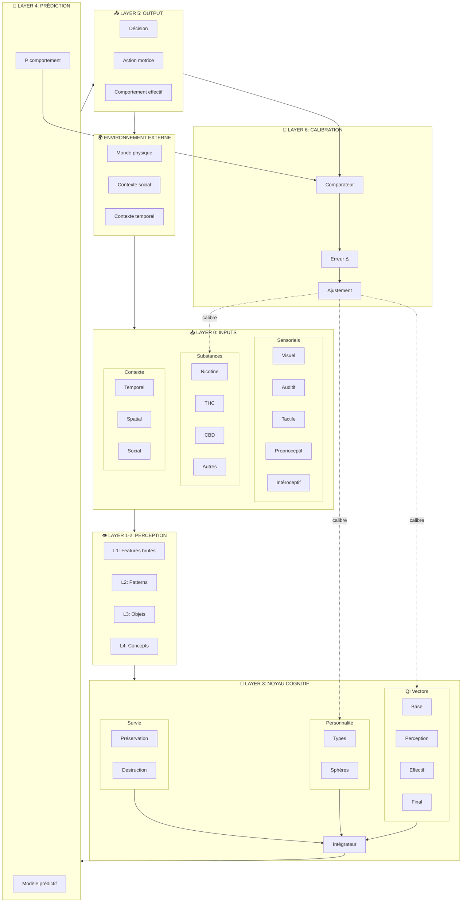

---

## 2. Layers d'abstraction

### 2.0 Layer 0 — Inputs (Acquisition)

**Fonction:** Capturer les données brutes du monde et de l'état interne.

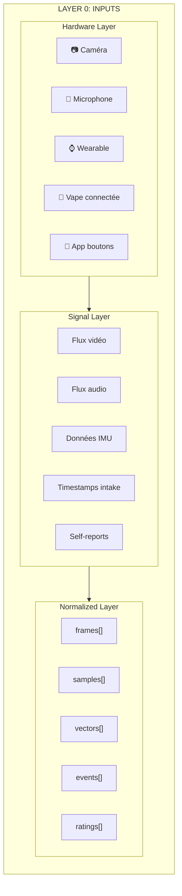

| Input Type | Hardware possible | Signal | Fréquence | Certitude |
|------------|------------------|--------|-----------|-----------|
| Visuel | Caméra / Google Glass | Frames RGB | 30 fps | Haute |
| Auditif | Microphone | Samples audio | 44.1 kHz | Haute |
| Proprioceptif | IMU / Accéléromètre | Vecteurs 3D | 100 Hz | Moyenne |
| Cardiaque | Smart ring / Watch | BPM, HRV | 1 Hz | Haute |
| Substances | Vape connectée / Bouton | Event timestamp | Event-driven | Variable |
| Self-report | App UI | Rating scale | On-demand | Basse-Moyenne |

---

### 2.1 Layer 1 — Features brutes (Extraction)

**Fonction:** Extraire les caractéristiques de bas niveau des signaux bruts.

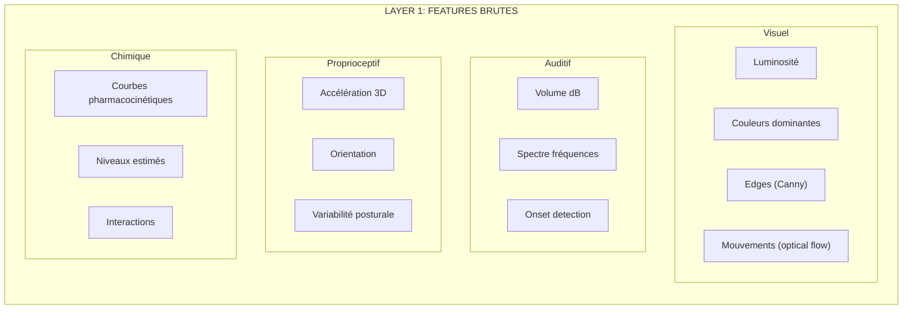

**Opérations:**
- Filtrage du bruit
- Normalisation
- Extraction de features (FFT, edge detection, etc.)
- Calcul des courbes de substances

---

### 2.2 Layer 2 — Patterns (Agrégation)

**Fonction:** Regrouper les features en patterns reconnaissables.

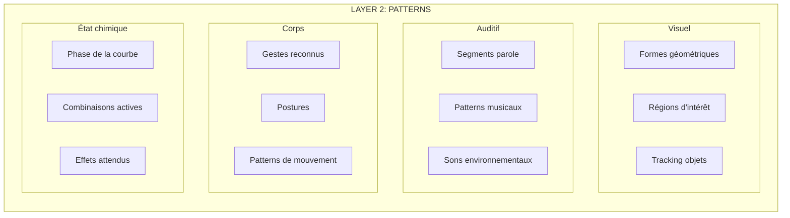

---

### 2.3 Layer 3 — Objets (Reconnaissance)

**Fonction:** Identifier des entités discrètes à partir des patterns.

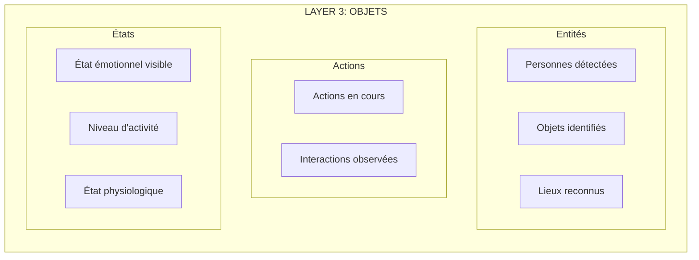

---

### 2.4 Layer 4 — Concepts (Sémantique)

**Fonction:** Mapper les objets sur des catégories significatives pour la survie et la cognition.

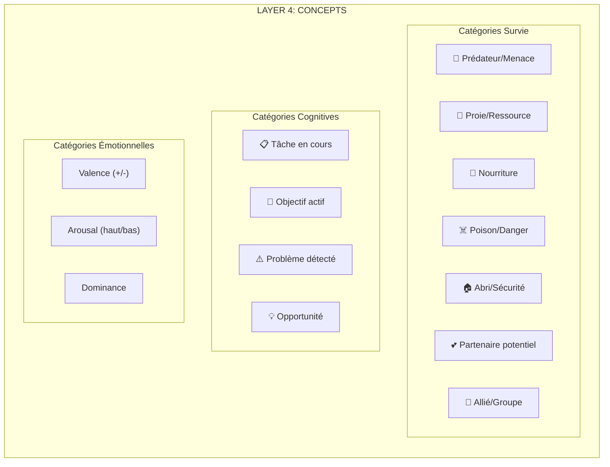

---

### 2.5 Layer 5 — Noyau Cognitif (Intégration)

**Fonction:** Combiner toutes les informations pour produire un état cognitif intégré.

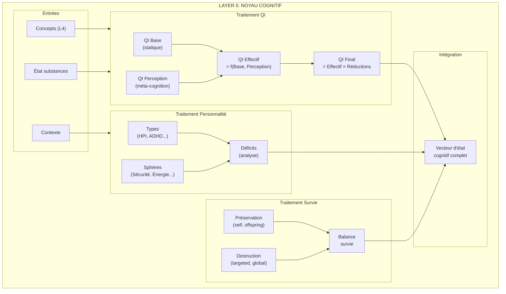

**Équations clés (à formaliser en Layer Math):**

```
QI_effective[i] = f(QI_base[i], QI_perception[i])

QI_final[i] = QI_effective[i] × global_reduction × sphere_modifiers[i]

global_reduction = Π(1 - factor_weight[j] × factor_impact[j])

cognitive_state = {QI_final[], spheres[], survival_balance, active_concepts[]}
```

---

### 2.6 Layer 6 — Prédiction (Décision)

**Fonction:** Prédire le comportement le plus probable étant donné l'état cognitif.

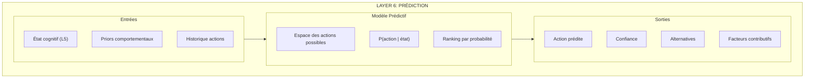

**Catégories d'actions:**

| Catégorie | Exemples | Drivers principaux |
|-----------|----------|-------------------|
| Approach_food | Manger, boire, cuisiner | Faim, opportunité |
| Avoid_threat | Fuir, se cacher, combattre | Sécurité basse, menace détectée |
| Seek_rest | Dormir, s'asseoir, pause | Énergie basse |
| Social_engage | Parler, toucher, approcher | Besoin social, partenaire |
| Task_execute | Travailler, créer, résoudre | Objectif actif, QI disponible |
| Substance_intake | Prendre hit, boire alcool | Craving, habitude, régulation |
| Self_harm | Comportements destructeurs | Survie_destruction élevé |

---

### 2.7 Layer 7 — Output (Action)

**Fonction:** Exécuter l'action et la rendre observable.

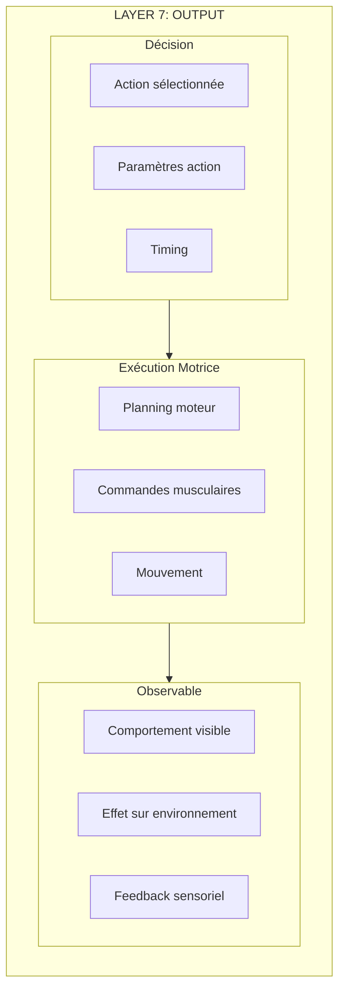

---

### 2.8 Layer 8 — Calibration (Apprentissage)

**Fonction:** Comparer prédiction et observation, ajuster le modèle.

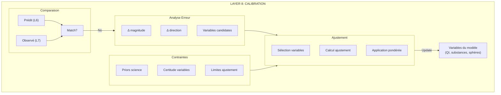

**Algorithme de calibration:**

```
1. IF prediction ≠ observation:
2.     error = compute_error(prediction, observation)
3.     candidates = identify_candidate_variables(error, model_state)
4.     FOR each candidate in candidates:
5.         adjustment = error × (1 - candidate.certainty) × explanatory_power(candidate, error)
6.         IF adjustment > MAX_ADJUSTMENT:
7.             adjustment = MAX_ADJUSTMENT
8.         IF adjustment contradicts prior:
9.             adjustment = 0 (or flag for review)
10.        candidate.value += adjustment
11.        candidate.certainty = update_certainty(candidate, observation_count)
12.    log_calibration(error, adjustments)
```

---

## 3. Flux de données

### 3.1 Flux principal (Forward)

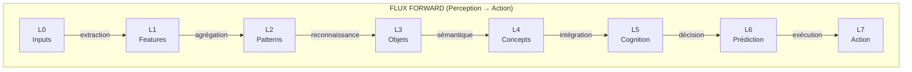

**Latences cibles:**

| Transition | Latence cible | Criticité |
|------------|---------------|-----------|
| L0 → L1 | < 50ms | Haute (temps réel) |
| L1 → L2 | < 100ms | Haute |
| L2 → L3 | < 200ms | Moyenne |
| L3 → L4 | < 100ms | Moyenne |
| L4 → L5 | < 50ms | Haute |
| L5 → L6 | < 100ms | Haute |
| L6 → L7 | Variable | Dépend de l'action |
| **Total** | < 600ms | — |

---

### 3.2 Flux feedback (Calibration)

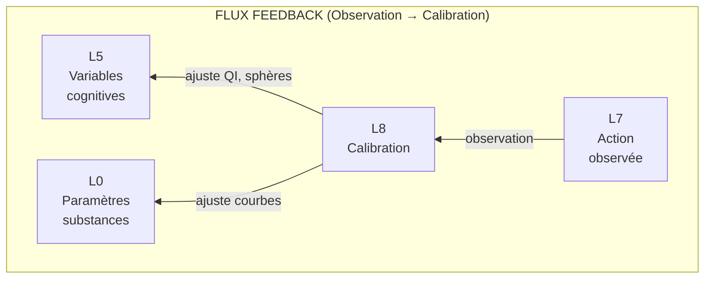

---

### 3.3 Flux latéral (Contexte)

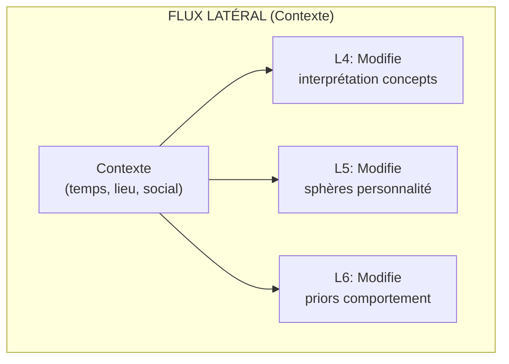

---

## 4. Composants détaillés

### 4.1 Pharmacokinetic Engine

**Responsabilité:** Calculer les niveaux de substances en temps réel.

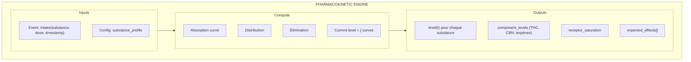

**Modèle two-compartment:**

```
dA/dt = -k_abs × A                    (absorption)
dC/dt = k_abs × A - k_elim × C        (central compartment)

level(t) = dose × bioavailability × (e^(-k_elim×t) - e^(-k_abs×t)) / (k_abs - k_elim)
```

---

### 4.2 QI Processor

**Responsabilité:** Calculer les QI finals à partir des bases et de l'état actuel.

```mermaid
flowchart TB
    subgraph QI_PROC["QI PROCESSOR"]
        
        subgraph INPUTS_QI["Inputs"]
            I1["qi_base[i] — from tests"]
            I2["qi_perception[i] — from self-report"]
            I3["substance_levels — from pharma engine"]
            I4["spheres — from personality module"]
            I5["priors — from knowledge base"]
        end
        
        subgraph COMPUTE_QI["Compute"]
            C1["qi_effective[i] = combine(base, perception)"]
            C2["global_reduction = compute_reduction(substances, fatigue, stress)"]
            C3["sphere_modifiers[i] = apply_sphere_effects(spheres, qi_type[i])"]
            C4["prior_modifiers[i] = apply_priors(priors, state)"]
            C5["qi_final[i] = qi_effective[i] × global_reduction × sphere_mod × prior_mod"]
        end
        
        subgraph OUTPUTS_QI["Outputs"]
            O1["qi_final[i] for each intelligence type"]
            O2["qi_global (weighted average)"]
            O3["confidence[i] for each"]
        end
        
        INPUTS_QI --> COMPUTE_QI --> OUTPUTS_QI
    end
```

---

### 4.3 Behavior Predictor

**Responsabilité:** Prédire l'action la plus probable.

```mermaid
flowchart TB
    subgraph PREDICTOR["BEHAVIOR PREDICTOR"]
        
        subgraph INPUTS_BP["Inputs"]
            I1["cognitive_state — from QI processor"]
            I2["active_concepts — from perception"]
            I3["survival_balance — from survival module"]
            I4["action_history — from memory"]
        end
        
        subgraph COMPUTE_BP["Compute"]
            C1["action_space = enumerate_possible_actions(context)"]
            C2["FOR each action in action_space:"]
            C3["    P(action) = base_probability(action, cognitive_state)"]
            C4["    P(action) *= survival_modifier(action, survival_balance)"]
            C5["    P(action) *= habit_modifier(action, action_history)"]
            C6["    P(action) *= opportunity_modifier(action, active_concepts)"]
            C7["normalize(P)"]
            C8["predicted_action = argmax(P)"]
        end
        
        subgraph OUTPUTS_BP["Outputs"]
            O1["predicted_action"]
            O2["confidence = P(predicted_action)"]
            O3["alternatives = top_k(P, k=3)"]
            O4["contributing_factors[]"]
        end
        
        INPUTS_BP --> COMPUTE_BP --> OUTPUTS_BP
    end
```

---

### 4.4 Calibration Engine

**Responsabilité:** Apprendre des erreurs de prédiction.

```mermaid
flowchart TB
    subgraph CALIBRATION["CALIBRATION ENGINE"]
        
        subgraph INPUTS_CAL["Inputs"]
            I1["predicted_action — from predictor"]
            I2["observed_action — from observation"]
            I3["model_state — snapshot at prediction time"]
            I4["variable_certainties — current confidence levels"]
        end
        
        subgraph COMPARE_CAL["Compare"]
            C1{"predicted == observed?"}
        end
        
        subgraph ANALYZE["Analyze (if mismatch)"]
            A1["error_type = categorize(predicted, observed)"]
            A2["error_magnitude = compute_distance(predicted, observed)"]
            A3["candidate_vars = identify_explanatory_variables(error_type, model_state)"]
        end
        
        subgraph ADJUST_CAL["Adjust"]
            AD1["FOR each var in candidate_vars:"]
            AD2["    explanatory_power = compute_correlation(var, error)"]
            AD3["    adjustment_weight = (1 - var.certainty) × explanatory_power"]
            AD4["    delta = error_magnitude × adjustment_weight × LEARNING_RATE"]
            AD5["    var.value += clip(delta, -MAX_ADJ, +MAX_ADJ)"]
            AD6["    var.certainty = update(var.certainty, observation_count)"]
        end
        
        subgraph LOG_CAL["Log"]
            L1["calibration_entry = {timestamp, error, adjustments}"]
            L2["append to calibration_history"]
        end
        
        INPUTS_CAL --> COMPARE_CAL
        COMPARE_CAL -->|"Yes"| LOG_CAL
        COMPARE_CAL -->|"No"| ANALYZE
        ANALYZE --> ADJUST_CAL --> LOG_CAL
    end
```

---

## 5. Boucle de feedback

### 5.1 Vue temporelle

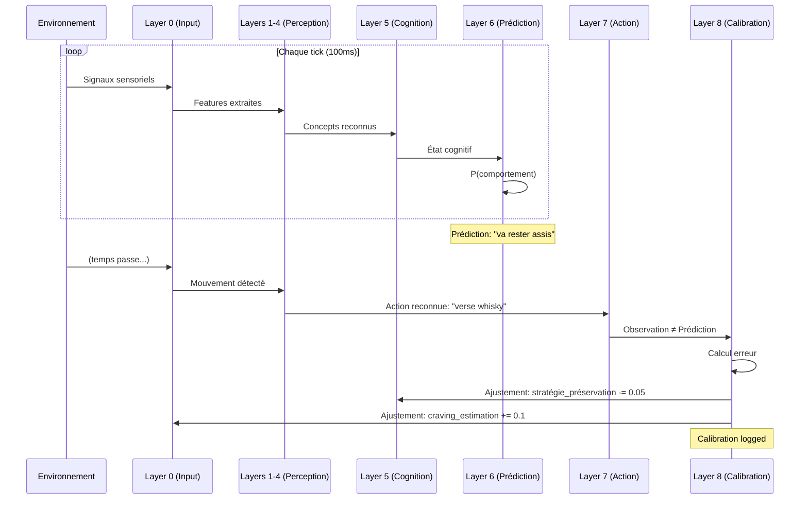

---

### 5.2 Fréquences des boucles

| Boucle | Fréquence | Description |
|--------|-----------|-------------|
| Perception loop | 10 Hz (100ms) | Update des features et concepts |
| Cognition loop | 2 Hz (500ms) | Update de l'état cognitif complet |
| Prediction loop | 1 Hz (1s) | Nouvelle prédiction comportementale |
| Calibration loop | Event-driven | Quand observation disponible |
| Substance loop | 0.1 Hz (10s) | Update des courbes pharmacocinétiques |

---

## 6. Interfaces

### 6.1 Interface Input (L0)

```yaml
InputEvent:
  type: enum [substance_intake, sensor_reading, self_report, context_change]
  timestamp: datetime
  source: string
  payload:
    # Variable selon type
```

**Events substance:**
```yaml
SubstanceIntakeEvent:
  type: "substance_intake"
  timestamp: "2025-01-25T15:30:00Z"
  source: "app_button"
  payload:
    substance: "thc"
    delivery_method: "pulmonary"
    dose_unit: "hits"
    dose_value: 1
    temperature_celsius: 230
```

**Events self-report:**
```yaml
SelfReportEvent:
  type: "self_report"
  timestamp: "2025-01-25T15:35:00Z"
  source: "app_slider"
  payload:
    variable: "core.personality.spheres.security.value"
    value: 45
    scale: [0, 100]
```

---

### 6.2 Interface Observation (L7 → L8)

```yaml
ObservationEvent:
  timestamp: datetime
  detection_method: enum [video_analysis, self_report, sensor, inferred]
  certainty: float [0-1]
  behavior:
    category: string  # from behavior taxonomy
    specific_action: string
    parameters: object  # action-specific
```

**Exemple:**
```yaml
ObservationEvent:
  timestamp: "2025-01-25T15:32:00Z"
  detection_method: "video_analysis"
  certainty: 0.85
  behavior:
    category: "substance_intake"
    specific_action: "pour_drink"
    parameters:
      substance: "alcohol"
      container: "whisky_glass"
      estimated_volume_ml: 50
```

---

### 6.3 Interface Calibration (L8 output)

```yaml
CalibrationEntry:
  timestamp: datetime
  prediction:
    action: string
    confidence: float
  observation:
    action: string
    certainty: float
  error:
    type: enum [correct, wrong_action, wrong_timing, wrong_intensity]
    magnitude: float
  adjustments:
    - variable: string (path)
      old_value: float
      new_value: float
      reason: string
```

---

## 7. États du système

### 7.1 State Machine globale

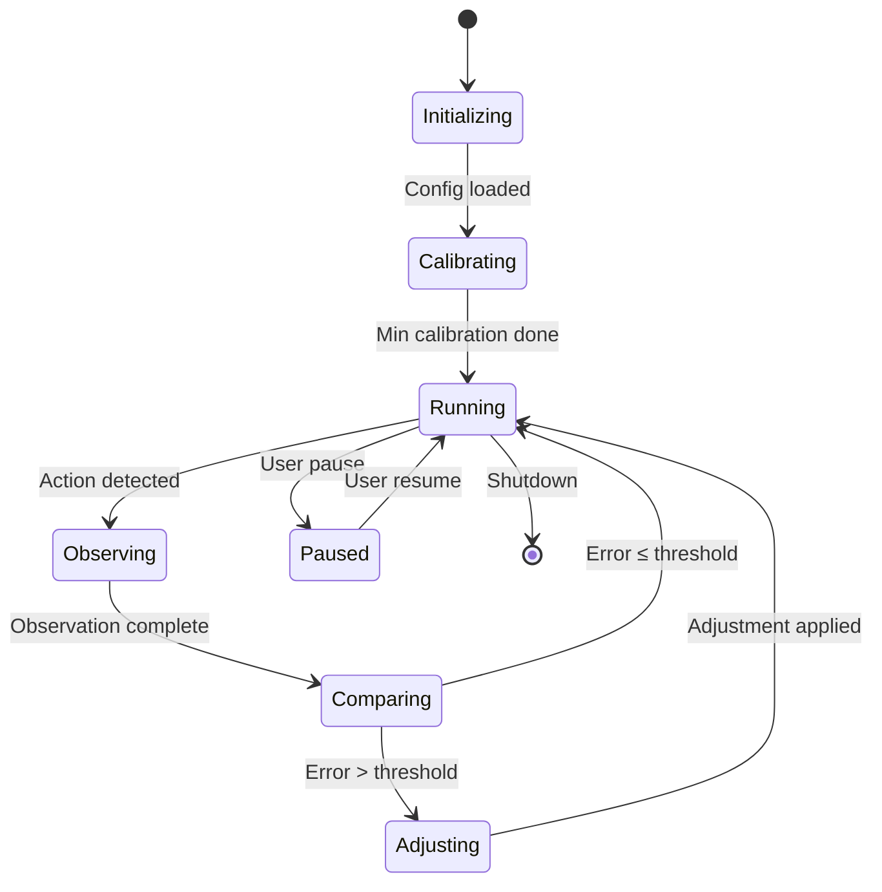

### 7.2 États des variables

Chaque variable peut être dans un des états suivants:

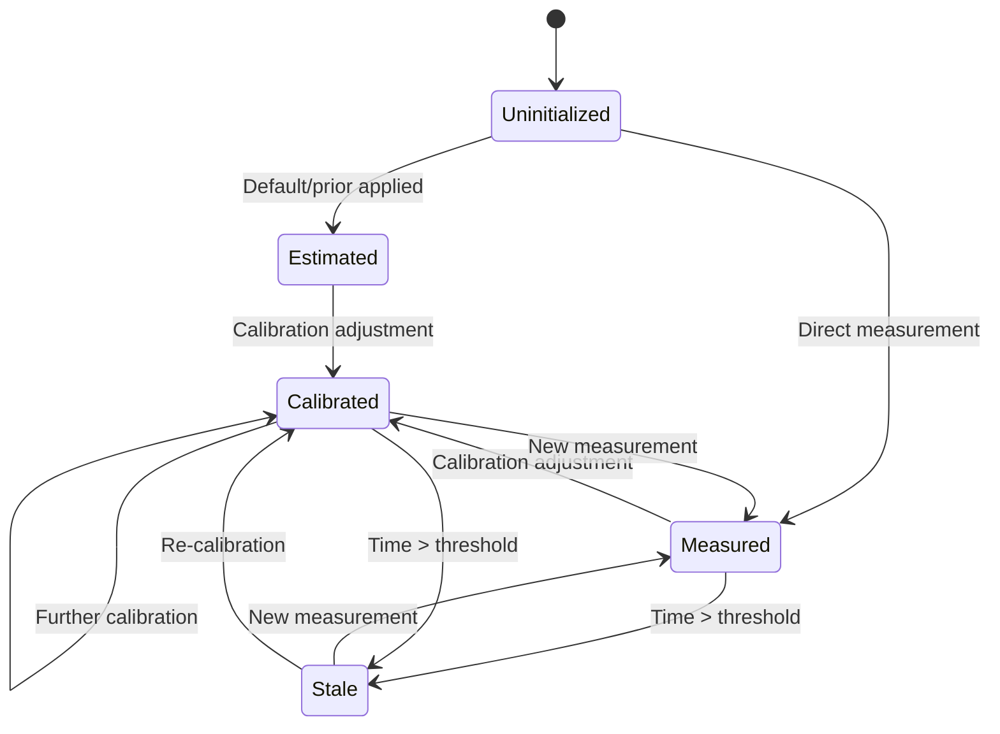

---

## 8. Prochaines étapes

### 8.1 Ce document définit

- ✅ Layers d'abstraction (L0-L8)
- ✅ Flux de données (forward, feedback, latéral)
- ✅ Composants principaux et leurs responsabilités
- ✅ Interfaces entre composants
- ✅ États du système

### 8.2 Documents suivants nécessaires

| Document | Contenu |
|----------|---------|
| **MATH_MODEL.md** | Formules statistiques, distributions, algorithmes de learning |
| **APP_ARCHITECTURE.md** | Stack technique, UI/UX, hardware, déploiement |
| **PRIORS_DATABASE.md** | Catalogue complet des priors comportementaux |
| **INSTANCE_TEMPLATE.yaml** | Template pour fichiers individuels (NLR, Aurore) |

---

## Appendix A: Taxonomie des comportements

```yaml
behavior_taxonomy:
  physiological:
    - eat
    - drink
    - sleep
    - excrete
    - breathe_change (sigh, hyperventilate)
    
  substance:
    - intake_nicotine
    - intake_thc
    - intake_cbd
    - intake_alcohol
    - intake_other
    
  motor:
    - sit
    - stand
    - walk
    - run
    - reach
    - grasp
    - release
    
  social:
    - approach_person
    - avoid_person
    - speak
    - listen
    - touch
    - gesture
    
  cognitive:
    - focus_task
    - switch_task
    - abandon_task
    - seek_information
    - create
    
  emotional:
    - express_joy
    - express_anger
    - express_sadness
    - express_fear
    - suppress_emotion
    
  self_regulation:
    - self_soothe
    - seek_stimulation
    - avoid_stimulation
    - self_harm
```

---

## Appendix B: Glossaire

| Terme | Définition |
|-------|------------|
| **Layer** | Niveau d'abstraction dans le traitement de l'information |
| **Forward flux** | Flux de données de la perception vers l'action |
| **Feedback flux** | Flux de données de l'observation vers la calibration |
| **Certainty** | Degré de confiance dans une valeur (0-1) |
| **Prior** | Contrainte basée sur la connaissance scientifique existante |
| **Calibration** | Ajustement des paramètres du modèle basé sur les observations |
| **Cognitive state** | Vecteur complet décrivant l'état mental à un instant t |
| **Global reduction** | Facteur multiplicatif affectant toutes les capacités cognitives |

---

*Document généré pour Mind-MCP v0.1.0*
*Architecture logique — Draft*
